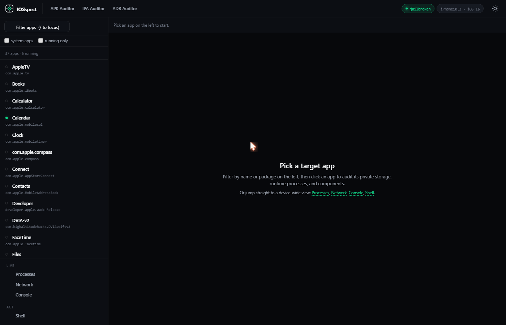

# IOSspect

On-device runtime auditor for jailbroken iOS. Serves an HTTPS dashboard from the phone; you drive it from a browser on the same network or over `127.0.0.1`. Read any installed app's bundle and data container, run SQL against its databases, tail the system log, run a root shell, package the bundle as an `.ipa`.

## Compatibility

|  |  |
| - | - |
| iOS min | 15.0 |
| iOS max | 26.x |
| Architectures | arm64 |
| Required | jailbreak with root and the `platform-application` entitlement (palera1n rootless, Dopamine, etc.) |

Why jailbreak only: reading another app's `Containers/Data/Application/<UUID>/` is sandbox-blocked on stock iOS. TrollStore alone is not enough; the daemon needs both root and `platform-application` to step past per-container ACLs and to `posix_spawn` arbitrary binaries.

## Install

### Sileo / Zebra

1. Sources tab, `+`, paste `https://thecybersandeep.github.io/iosspect/`
2. Find **IOSspect**, tap **Get**
3. Open the IOSspect icon on the home screen
4. The dashboard shows: URL, cert fingerprint, browser password, **Start server**
5. Open the URL in any browser, accept the self-signed cert once, sign in with the password


### Manual `.deb`

Grab the latest from [Releases](https://github.com/thecybersandeep/iosspect/releases) and `dpkg -i com.iosspect.tool_*.deb` over SSH. Both rootful and rootless variants are built per push.

## What's in it

| Tab | What it shows |
| - | - |
| Files | Walk an app's data container or bundle. Click a file to preview as text, hex, plist, SQLite, or image. KTX snapshots decode via `UIImage`. Recursive grep and per-directory ZIP download. |
| Frameworks | Every Mach-O in the bundle (main binary, `Frameworks/*.dylib`, `*.framework`, `PlugIns/*.appex`). Per-slice arch, symbol-stripped flag, FairPlay encryption flag. Download any slice. |
| Processes | `sysctl kern.proc.all` + `proc_pidinfo` per pid. RSS, threads, state, parent. Each process is mapped to a bundle id when it lives under a `*.app` so the app list dot turns green for running apps. |
| Network | `netstat -an` parse. TCP / UDP, IPv4 / IPv6, local + remote addr, state. |
| Console | Tails `/var/log/com.apple.xpc.launchd/launchd.log` via a polling endpoint. Filter by substring or pid, save buffer to a file. |
| Shell | `posix_spawn /bin/sh -c <command>` as root. PATH is widened to include `/var/jb/usr/bin`, `/var/jb/usr/sbin`, etc., so `id`, `ls`, `ps`, `netstat`, `lsof` all resolve. |
| (App actions) | Download IPA (streams the bundle as `Payload/<App>.app/...` zip; still FairPlay-encrypted for App Store installs). Wipe data container (kills any running processes under the bundle, then `rm -rf` the contents). |

## Build (CI)

Push to `main`. The `build` workflow on `ubuntu-latest`:

1. installs Theos via `theos/setup-theos-jailed`
2. pulls the iPhoneOS SDK from `theos/sdks`
3. runs `make package FINALPACKAGE=1` twice (rootful + rootless)
4. uploads both `.deb` files as workflow artifacts
5. on a tag push, attaches them to a GitHub Release

The `publish-repo` workflow drops the produced `.deb` into `repo/debs/`, regenerates `Packages`/`Packages.bz2`/`Packages.gz`/`Release`, force-pushes `repo/` to `gh-pages`. Sileo / Zebra clients see the new version on next refresh.

## Build (locally)

Requires Theos + iOS SDK on Linux or macOS.

```
git clone https://github.com/thecybersandeep/iosspect
cd iosspect
make package FINALPACKAGE=1
# rootless variant:
THEOS_PACKAGE_SCHEME=rootless make clean package FINALPACKAGE=1
```


## Screenshots

The dashboard, served from the phone over HTTPS and viewed in a desktop browser:



Top right shows the live device state (`jailbroken` / `iPhone10,3 . iOS 16`), the sidebar lists every installed app with a green dot for processes that are actually running, and the bottom-left rail jumps between `Processes`, `Network`, `Console`, and a root `Shell`. Click an app to drop into its data container (`Files`) or its Mach-O bundle (`Frameworks`).

## License

MIT.

---
